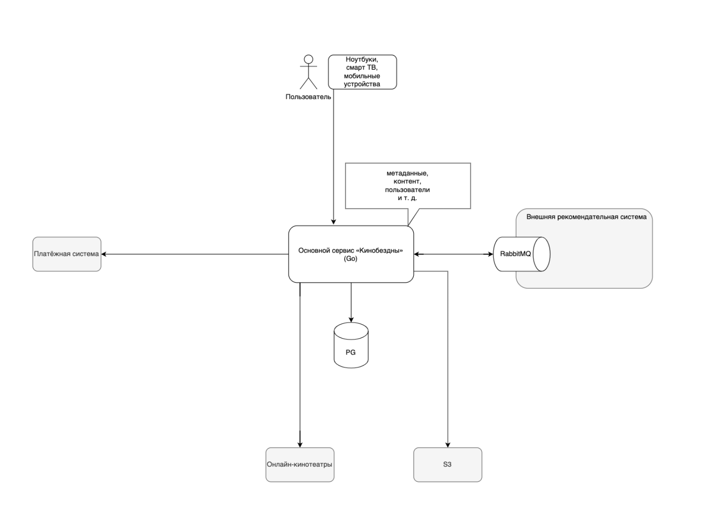
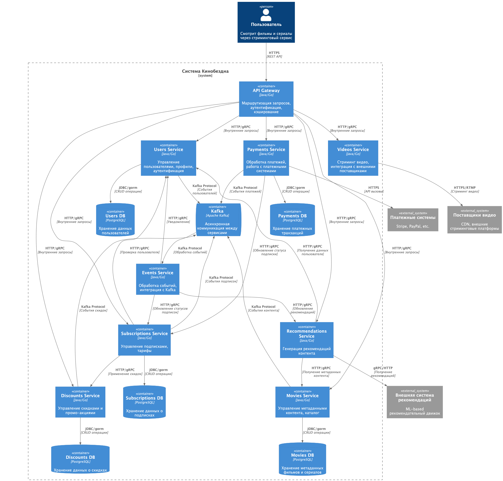

# Импакт анализ проекта «Кинобездна»

# AS-IS

Небольшой стартап «Кинобездна» пять лет назад организовал стриминговый сервис, 
где пользователи могут посмотреть контент из других сервисов и открытых источников 
по единой подписке.
Стартап вырос и превратился в крупный онлайн-кинотеатр — агрегатор. 
Кратно выросло количество пользователей и различных интеграций с сервисами лояльности, 
маркетплейсами, платёжными системами и так далее.

## Текущее решение

* Большой и запутанный монолит на Go c СУБД PostgreSQL.
* Одна база данных.
* Сущности в базе: платежи, пользователи, видео, подписки, скидки, метаданные о фильмах (жанры, актёры, оценки).
* Все вызовы за исключением взаимодействия с рекомендательной системой сейчас происходят синхронно. Пользователь открывает сайт, аутентифицируется, выбирает фильм, может оценить фильм и составить папку с избранным.
* Сторонняя рекомендательная система делает подборку.
* API компании построено в соответствии с REST-стилем.
* Клиенты сервиса используют мобильные устройства, ноутбуки, смарт ТВ. Как следствие, на разных девайсах различаются интерфейсы и количество данных.

# TO-BE

## Домены и границы контекстов

### Пользователи - Users
Домен включает в себя: управление пользователями, профили, аутентификация.

### Платежи - Payments
Обработка платежей, работа с платежными системами.

### Подписки - Subscriptions
Управление подписками, тарифы.

### Скидки - Discounts
Управление скидками и промо-акциями.

### Фильмы - Movies
Управление метаданными контента, каталог.

### Контент - Videos
Стриминг видео, интеграция с внешними поставщиками.

### Рекомендации - Recommendations
Генерация рекомендаций контента с использованием внешней системы.

## Диаграмма контейнеров

[Диаграмма контейнеров (Containers)](tests-results-1-all.1.txt)
